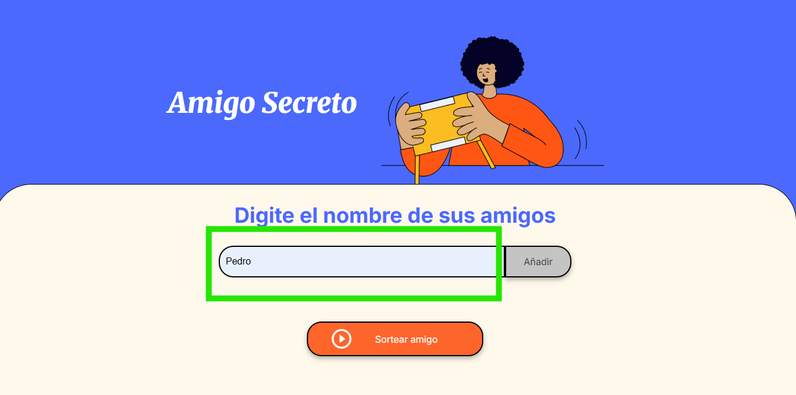
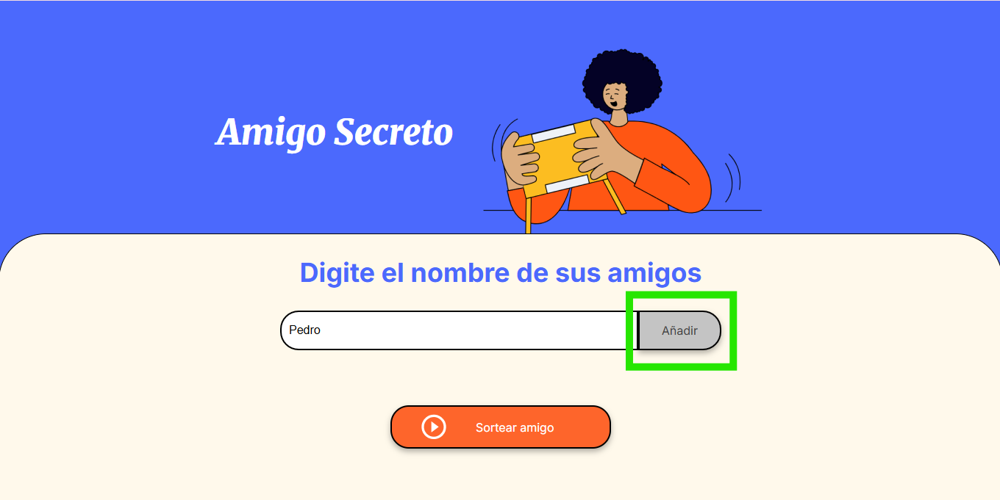
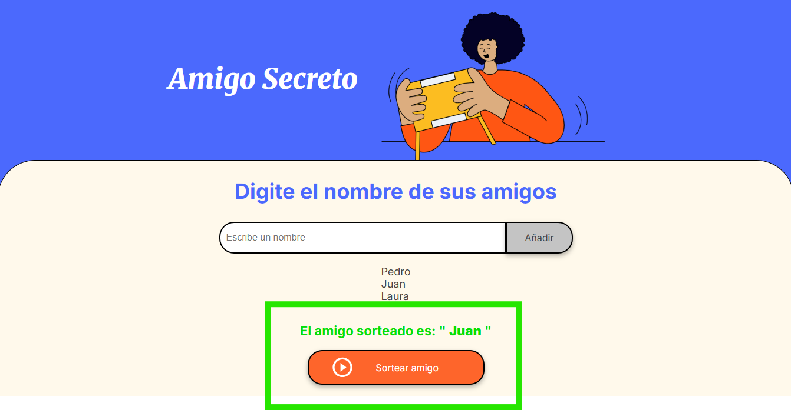

# 🎁 Juego del Amigo Secreto

---

## 🏷️ Insignias

---

## 📖 Índice

- [Descripción del Proyecto](#-descripción-del-proyecto)
- [Estado del Proyecto](#-estado-del-proyecto)
- [Instrucciones](#-instrucciones)
- [Acceso al Proyecto](#-acceso-al-proyecto)
- [Tecnologías Utilizadas](#-tecnologías-utilizadas)
- [Personas Desarrolladoras del Proyecto](#-personas-desarrolladoras-del-proyecto)

---

## 📌 Descripción del Proyecto
Este pryecto consiste en una aplicación web sencilla para jugar al **Amigo Secreto**.
Permite a los usuarios ingresar nombres en una lista y realizar un sorteo aleatorio para determinar quien sera su amigo secreto.
Su objetvo principal es **practicar lógica de programción con javaScript**

---

## 🚧 Estado del Proyecto
✅ Proyecto Terminado y Funcional.
📌 Posibles mejoras:
- Validar nombres duplicados.
- Permitir borrar amigos de la lista.

---

## 🎬 Instrucciones

1. Ingresar nombres en el campo de texto.

2. Presionar **añadir** para guardarlos en una lista.

3. Ver todos los nombres guardados.

4. Presionar **Sortear amigo** para obtener el nombre del amigo secreto al azar.

En este ejemplo, el amigo secreto es Juan.

---

## 🗝️ Acceso al Proyecto

Clona este repositorio con el comando:

git clone https://github.com/Jo-mastr/challenge-amigo-secreto.git

Luego abre el archivo index.html en tu navegador.

---

## 🛠️ Tecnologías Utilizadas

- **HTML5**
- **CSS**
- **JavaScript**

---

## 👨‍💻 Personas Desarrolladoras del Proyecto

- **HTML y CSS: Alura Latam**
- **JavaScript: Jorge Iturra** 
